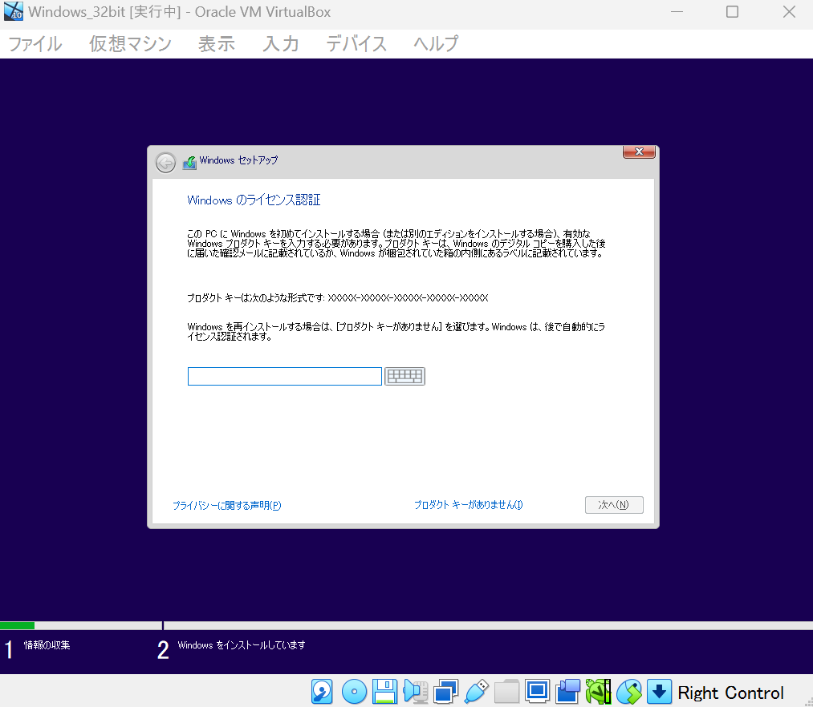

# OS自作

## Day1
ほとんどサンプルのものをコピーした.
最初はバイナリエディタの内容を写そうと思ったが無駄だと思ってやめた.

### helloos0
こんな感じのqemuを起動できた。


### helloos1
asmでimgファイルを作成できるようになった

### helloos2
以下のようなアセンブラのコードが与えられた.  
大事なところは**メッセージ部分** のところ

DB命令 : DataByteの略,ファイルに1バイト分命令を直接書ける  
DW命令 : DataWordの略,word = 16bit = 2byte分命令を書ける  
DD命令 : DataDouble-wordの略,2word = 26bit = 4byte分命令を書ける  
RESB命令 : ReserveByteの略,"RESB {int}"で{int}byte分予約を行い,0x00で埋めてくれる(0xがついているので16進数)  
& : 先頭から何byte目かが格納されている変数  

```m68k
; hello-os
; TAB=4

; 以下は標準的なFAT12フォーマットフロッピーディスクのための記述

		DB		0xeb, 0x4e, 0x90
		DB		"HELLOIPL"		; ブートセクタの名前を自由に書いてよい（8バイト）
		DW		512				; 1セクタの大きさ（512にしなければいけない）
		DB		1				; クラスタの大きさ（1セクタにしなければいけない）
		DW		1				; FATがどこから始まるか（普通は1セクタ目からにする）
		DB		2				; FATの個数（2にしなければいけない）
		DW		224				; ルートディレクトリ領域の大きさ（普通は224エントリにする）
		DW		2880			; このドライブの大きさ（2880セクタにしなければいけない）
		DB		0xf0			; メディアのタイプ（0xf0にしなければいけない）
		DW		9				; FAT領域の長さ（9セクタにしなければいけない）
		DW		18				; 1トラックにいくつのセクタがあるか（18にしなければいけない）
		DW		2				; ヘッドの数（2にしなければいけない）
		DD		0				; パーティションを使ってないのでここは必ず0
		DD		2880			; このドライブ大きさをもう一度書く
		DB		0,0,0x29		; よくわからないけどこの値にしておくといいらしい
		DD		0xffffffff		; たぶんボリュームシリアル番号
		DB		"HELLO-OS   "	; ディスクの名前（11バイト）
		DB		"FAT12   "		; フォーマットの名前（8バイト）
		RESB	18				; とりあえず18バイトあけておく

; プログラム本体

		DB		0xb8, 0x00, 0x00, 0x8e, 0xd0, 0xbc, 0x00, 0x7c
		DB		0x8e, 0xd8, 0x8e, 0xc0, 0xbe, 0x74, 0x7c, 0x8a
		DB		0x04, 0x83, 0xc6, 0x01, 0x3c, 0x00, 0x74, 0x09
		DB		0xb4, 0x0e, 0xbb, 0x0f, 0x00, 0xcd, 0x10, 0xeb
		DB		0xee, 0xf4, 0xeb, 0xfd

; メッセージ部分

		DB		0x0a, 0x0a		; 改行を2つ
		DB		"This is ArgOS......"
		DB		0x0a			; 改行
		DB		0

		RESB	0x1fe-$			; 0x001feまでを0x00で埋める命令

		DB		0x55, 0xaa

; 以下はブートセクタ以外の部分の記述

		DB		0xf0, 0xff, 0xff, 0x00, 0x00, 0x00, 0x00, 0x00
		RESB	4600
		DB		0xf0, 0xff, 0xff, 0x00, 0x00, 0x00, 0x00, 0x00
		RESB	1469432
```
FAT12フォーマット : WSやMS-dosの標準フォーマット形式
ブートセクタ : FDの最初のセクタ,1セクタ = 512byte.1FD = 1,440kbなので1FD = 2,800セクタ  
PCは起動時最初のセクタと最後の2byteを読んでそれが"55 AA"であるかどうかで起動の可否を判断するらしいが,このコードはメッセージ部分の最後に"55 AA"が存在するので言っていることと違う気がする......と思ったが、もしかしたら"55 AA"を探索する→見つかる→それを末尾をとしてそのセクタの頭から実行する.という形になっているのかも??  
IPL : InitialProgramLoaderの略,OSのブートセクタは普通1セクタで収まらないため外部のプログラムを読み込む都合上ブートセクタをIPLって読んだりする,現段階ではそんなことしないので普通に嘘,OS5からIPLを採用  
ブート : bootstrap,ほらふき男爵の冒険  
こんな感じで正しく表示された   


## Day2
### helloos3
- ORG命令 : origin命令,PCのメモリのどこに読み込まれるかをアセンブラ(今回はnask)に教える命令  
- JUMP命令 : goto文と同じ  
- MOV命令 :代入命令
- msg : ラベルのこと
- [] : []はメモリの番地を表す,"データの大きさ [番地]"の形で,つまり 'MOV AL,[SI]'は'MOV AL, BYTE [SI]だが,MOV命令はbit数が同じなことは約束なので'MOV AL,[SI](メモリのSI番地の1バイトの内容をALに読み込め)
- ADD命令 : 足し算命令,"ADD SI, 1" = "SI = SI + 1"
- CMP命令 : 比較命令,"CMP AL,0" = "if (CMP == 0)"
- JE命令 : Jump if Equal,前述のCMPがtrueの時にjumpする
- INT命令 : Interrupt命令,割り込み処理
  - BIOS(Basic Input Output System) : ROM(Read Only System)に書き込まれたOS開発者のための関数集まり,INT命令でその関数を呼び出す.INT {数字}で任意の数字の関数を呼ぶ
- HLT命令 : 入力があるまでcpuをアイドル状態にする命令,何もしないならHLTする習慣をつける,語源はhalt(停止させる)
#### CPUの代表的なレジスタ(16bitレジスタ)
- AX : アキュームレータ(Accumulator : 累積演算器)  
- CX : カウンタ(counter)
- DX : データ(data)
- BX : ベース(base)
- BP : ベースポインタ(Base Pointer : ベース用ポインタ)  
- SP : スタックポインタ(Stack Pointer : スタック用ポインタ)
- SI : ソースインデックス(Source Index : 読み込みインデックス)
- DI : デスティネーションインデックス(Destination Index : 書き込みインデックス)
xは拡張(extend)の意  
AXの下位bitをAL(low)と呼び,上位bitをAH(high)と呼ぶ
#### セグメントレジスタ(16bitレジスタ)
- ES : エクストラセグメント(extra segment : おまけセグメント)
- CS : コードセグメント(Code Segment)
- SS : スタックセグメント(Stack Segment)
- DS : データセグメント(Data Segment)
- FS,GS : 本名なし(おまけセグメント2,3)


```
; hello-os
; TAB=4

		ORG		0x7c00			; このプログラムがどこに読み込まれるのか

; 以下は標準的なFAT12フォーマットフロッピーディスクのための記述

		JMP		entry
		DB		0x90
		DB		"HELLOIPL"		; ブートセクタの名前を自由に書いてよい（8バイト）
		DW		512				; 1セクタの大きさ（512にしなければいけない）
		DB		1				; クラスタの大きさ（1セクタにしなければいけない）
		DW		1				; FATがどこから始まるか（普通は1セクタ目からにする）
		DB		2				; FATの個数（2にしなければいけない）
		DW		224				; ルートディレクトリ領域の大きさ（普通は224エントリにする）
		DW		2880			; このドライブの大きさ（2880セクタにしなければいけない）
		DB		0xf0			; メディアのタイプ（0xf0にしなければいけない）
		DW		9				; FAT領域の長さ（9セクタにしなければいけない）
		DW		18				; 1トラックにいくつのセクタがあるか（18にしなければいけない）
		DW		2				; ヘッドの数（2にしなければいけない）
		DD		0				; パーティションを使ってないのでここは必ず0
		DD		2880			; このドライブ大きさをもう一度書く
		DB		0,0,0x29		; よくわからないけどこの値にしておくといいらしい
		DD		0xffffffff		; たぶんボリュームシリアル番号
		DB		"HELLO-OS   "	; ディスクの名前（11バイト）
		DB		"FAT12   "		; フォーマットの名前（8バイト）
		RESB	18				; とりあえず18バイトあけておく

; プログラム本体

entry:
		MOV		AX,0			; レジスタ初期化
		MOV		SS,AX
		MOV		SP,0x7c00
		MOV		DS,AX
		MOV		ES,AX

		MOV		SI,msg          ; msgはジャンプ先のラベル
putloop:
		MOV		AL,[SI]
		ADD		SI,1			; SIに1を足す
		CMP		AL,0
		JE		fin
		MOV		AH,0x0e			; 一文字表示ファンクション
		MOV		BX,15			; カラーコード
		INT		0x10			; ビデオBIOS呼び出し
		JMP		putloop
fin:
		HLT						; 何かあるまでCPUを停止させる
		JMP		fin				; 無限ループ

msg:
		DB		0x0a, 0x0a		; 改行を2つ
		DB		"hello, world"
		DB		0x0a			; 改行
		DB		0

		RESB	0x7dfe-$		; 0x7dfeまでを0x00で埋める命令

		DB		0x55, 0xaa

; 以下はブートセクタ以外の部分の記述

		DB		0xf0, 0xff, 0xff, 0x00, 0x00, 0x00, 0x00, 0x00
		RESB	4600
		DB		0xf0, 0xff, 0xff, 0x00, 0x00, 0x00, 0x00, 0x00
		RESB	1469432

```

今回のコードは,msgの中身を一文字ずつ表示させ,データが空になったらhltさせるコード  
BIOSの命令コードのリファレンスは以下の通り  
#### 一文字表示
- AH = 0x0e;
- AL = キャラクターコード;
- BH = 0;
- BL = カラーコード;
- return None
- 注 : ビープ,バックスペース,CR,LFは制御コードとして認識

#### ORG    0x7c00の意味
0x7c00はメモリ内で約束されているブートセクタが読み込まれるアドレスの先頭

### helloos4
naskにディスクイメージ全体を作らせずに,とりま512バイトのブートセクタだけ担当してもらうようにする.  
よって,ブートセクタ以外の記述をカットし,helloos.nasからipl.nasに変更  
```; hello-os
; TAB=4

		ORG		0x7c00			; このプログラムがどこに読み込まれるのか

; 以下は標準的なFAT12フォーマットフロッピーディスクのための記述

		JMP		entry
		DB		0x90
		DB		"HELLOIPL"		; ブートセクタの名前を自由に書いてよい（8バイト）
		DW		512				; 1セクタの大きさ（512にしなければいけない）
		DB		1				; クラスタの大きさ（1セクタにしなければいけない）
		DW		1				; FATがどこから始まるか（普通は1セクタ目からにする）
		DB		2				; FATの個数（2にしなければいけない）
		DW		224				; ルートディレクトリ領域の大きさ（普通は224エントリにする）
		DW		2880			; このドライブの大きさ（2880セクタにしなければいけない）
		DB		0xf0			; メディアのタイプ（0xf0にしなければいけない）
		DW		9				; FAT領域の長さ（9セクタにしなければいけない）
		DW		18				; 1トラックにいくつのセクタがあるか（18にしなければいけない）
		DW		2				; ヘッドの数（2にしなければいけない）
		DD		0				; パーティションを使ってないのでここは必ず0
		DD		2880			; このドライブ大きさをもう一度書く
		DB		0,0,0x29		; よくわからないけどこの値にしておくといいらしい
		DD		0xffffffff		; たぶんボリュームシリアル番号
		DB		"HELLO-OS   "	; ディスクの名前（11バイト）
		DB		"FAT12   "		; フォーマットの名前（8バイト）
		RESB	18				; とりあえず18バイトあけておく

; プログラム本体

entry:
		MOV		AX,0			; レジスタ初期化
		MOV		SS,AX
		MOV		SP,0x7c00
		MOV		DS,AX
		MOV		ES,AX

		MOV		SI,msg
putloop:
		MOV		AL,[SI]
		ADD		SI,1			; SIに1を足す
		CMP		AL,0
		JE		fin
		MOV		AH,0x0e			; 一文字表示ファンクション
		MOV		BX,15			; カラーコード
		INT		0x10			; ビデオBIOS呼び出し
		JMP		putloop
fin:
		HLT						; 何かあるまでCPUを停止させる
		JMP		fin				; 無限ループ

msg:
		DB		0x0a, 0x0a		; 改行を2つ
		DB		"hello, world"
		DB		0x0a			; 改行
		DB		0

		RESB	0x7dfe-$		; 0x7dfeまでを0x00で埋める命令

		DB		0x55, 0xaa
```
また、asm.batもipl.binに変更し,ipl.lstを出力するように変更,
#### ipl.lst
どの命令がどの機械語と対応しているかが確認できるテキストファイル  
#### making.bat
ipl.binをもとにhelloos.imgを作成するバッチファイル.edimg.exeで空のイメージファイルにipl.binを読み込ませてhelloos.imgとして出力
#### 今後の流れ
!con -> asm -> makeing -> run

### MakeFileの作成
```# ファイル生成規則

ipl.bin : ipl.nas Makefile
	../z_tools/nask.exe ipl.nas ipl.bin ipl.lst

helloos.img : ipl.bin Makefile
	../z_tools/edimg.exe   imgin:../z_tools/fdimg0at.tek \
		wbinimg src:ipl.bin len:512 from:0 to:0   imgout:helloos.img
```

## Day3
### harib00a
#### 概要
FDの指定されたセクタを読む  
[INT 0x13](http://oswiki.osask.jp/?(AT)BIOS)
```
AH = 0x02; （読み込み時）
AH = 0x03; （書き込み時）
AH = 0x04; （ベリファイ時）
AH = 0x0c; （シーク時）
AL = 処理するセクタ数; （連続したセクタを処理できる）
CH = シリンダ番号 & 0xff;
CL = セクタ番号(bit0-5) | (シリンダ番号 & 0x300) >> 2;
DH = ヘッド番号;
DL = ドライブ番号;
ES:BX = バッファアドレス; （ベリファイ時、シーク時にはこれは参照しない）
戻り値：
FLAGS.CF == 0 ： エラーなし、AH == 0
FLAGS.CF == 1 ： エラーあり、AHにエラーコード（リセットファンクションと同じ）
```
- FLAGS.CF : キャリーフラグ : エラーがある場合は1を返す  
- CH,CL,DH : フロッピーの位置を示す,ヘッドが表裏,シリンダが外側を0とした輪の位置,セクタがそれを分割したもの  
- ES:BX : メモリのアドレス指定,番地　= ES x 16 + BX

```
; ディスクを読む

		MOV		AX,0x0820
		MOV		ES,AX
		MOV		CH,0			; シリンダ0
		MOV		DH,0			; ヘッド0
		MOV		CL,2			; セクタ2

		MOV		AH,0x02			; AH=0x02 : ディスク読み込み
		MOV		AL,1			; 1セクタ
		MOV		BX,0
		MOV		DL,0x00			; Aドライブ
		INT		0x13			; ディスクBIOS呼び出し
		JC		error
```

### harib00b
#### 概要
5回以上FDを読み込んでだめならエラー処理  
#### 新出命令
- JNC命令 : Jump if Not Carry: キャリーフラグが0の場合飛ぶ
- JAE命令 : Jum if above or equal : 以上なら飛ぶ
#### エラー時の処理
読み直す前に
- AH = 0x00
- DL = 0x00
- INT = 0x13
を行う
```
; ディスクを読む

		MOV		AX,0x0820
		MOV		ES,AX
		MOV		CH,0			; シリンダ0
		MOV		DH,0			; ヘッド0
		MOV		CL,2			; セクタ2

		MOV		SI,0			; 失敗回数を数えるレジスタ
retry:
		MOV		AH,0x02			; AH=0x02 : ディスク読み込み
		MOV		AL,1			; 1セクタ
		MOV		BX,0
		MOV		DL,0x00			; Aドライブ
		INT		0x13			; ディスクBIOS呼び出し
		JNC		fin				; エラーがおきなければfinへ
		ADD		SI,1			; SIに1を足す
		CMP		SI,5			; SIと5を比較
		JAE		error			; SI >= 5 だったらerrorへ
		MOV		AH,0x00
		MOV		DL,0x00			; Aドライブ
		INT		0x13			; ドライブのリセット
		JMP		retry
```

### haribo00c
#### 概要
エラーでないとき,nextラベルで次のセクタを読み込む
#### 次のセクタを読む方法
CL++して,ESを0x20だけ増やす(512を16進数で割った値)  
'ADD AX,512 / 16'でも'ADD BX 512'でも同値

#### 新出命令
- JBR命令 : Jump if Below or equal : 以下なら飛べ

## AL = 17の動作
一度に17セクタ読み込んでもこのプログラムは問題ないが,BIOSの読み込みファンクションに  
> 処理するセクタ数は0x01 ~ 0xffの範囲で指定  
との記述があるため,次回のプログラムのためにループで対応


```
; ディスクを読む

		MOV		AX,0x0820
		MOV		ES,AX
		MOV		CH,0			; シリンダ0
		MOV		DH,0			; ヘッド0
		MOV		CL,2			; セクタ2
readloop:
		MOV		SI,0			; 失敗回数を数えるレジスタ
retry:
		MOV		AH,0x02			; AH=0x02 : ディスク読み込み
		MOV		AL,1			; 1セクタ
		MOV		BX,0
		MOV		DL,0x00			; Aドライブ
		INT		0x13			; ディスクBIOS呼び出し
		JNC		next			; エラーがおきなければnextへ
		ADD		SI,1			; SIに1を足す
		CMP		SI,5			; SIと5を比較
		JAE		error			; SI >= 5 だったらerrorへ
		MOV		AH,0x00
		MOV		DL,0x00			; Aドライブ
		INT		0x13			; ドライブのリセット
		JMP		retry
next:
		MOV		AX,ES			; アドレスを0x200進める
		ADD		AX,0x0020
		MOV		ES,AX			; ADD ES,0x020 という命令がないのでこうしている
		ADD		CL,1			; CLに1を足す
		CMP		CL,18			; CLと18を比較
		JBE		readloop		; CL <= 18 だったらreadloopへ

```

### harib00d
#### 概要
C0-H0-S18の次であるディスクの裏(ヘッダ1)C0-H1-S1を0xa400から読み込む,その後C0-H1-S18 -> C1-H1-S1 -> C9-H1-S18まで読み込ませる
#### 新出命令
- JB命令 : Jump if Below:小さければジャンプしなさい
- EQU命令 : EQUal : #defineの用にマクロを設定する
```
; ディスクを読む

		MOV		AX,0x0820
		MOV		ES,AX
		MOV		CH,0			; シリンダ0
		MOV		DH,0			; ヘッド0
		MOV		CL,2			; セクタ2
readloop:
		MOV		SI,0			; 失敗回数を数えるレジスタ
retry:
		MOV		AH,0x02			; AH=0x02 : ディスク読み込み
		MOV		AL,1			; 1セクタ
		MOV		BX,0
		MOV		DL,0x00			; Aドライブ
		INT		0x13			; ディスクBIOS呼び出し
		JNC		next			; エラーがおきなければnextへ
		ADD		SI,1			; SIに1を足す
		CMP		SI,5			; SIと5を比較
		JAE		error			; SI >= 5 だったらerrorへ
		MOV		AH,0x00
		MOV		DL,0x00			; Aドライブ
		INT		0x13			; ドライブのリセット
		JMP		retry
next:
		MOV		AX,ES			; アドレスを0x200進める
		ADD		AX,0x0020
		MOV		ES,AX			; ADD ES,0x020 という命令がないのでこうしている
		ADD		CL,1			; CLに1を足す
		CMP		CL,18			; CLと18を比較
		JBE		readloop		; CL <= 18 だったらreadloopへ
		MOV		CL,1            ;ここからヘッダ1(裏側)
		ADD		DH,1
		CMP		DH,2
		JB		readloop		; DH < 2 だったらreadloopへ
		MOV		DH,0
		ADD		CH,1
		CMP		CH,CYLS         ;CYLSはどこまで読み込むかの値,今回は10,つまりセクタ0 ~ 9の10個目
		JB		readloop		; CH < CYLS だったらreadloopへ

```

#### make installしたときにエラー発生

##### エラー時のログ
```
.\tolset\harib00d>..\z_tools\make.exe install
../z_tools/make.exe -r img
make.exe[1]: Entering directory `C:/Users/nezum/Documents/Projents/tolset/harib00d'
../z_tools/make.exe -r haribote.img
make.exe[2]: Entering directory `C:/Users/nezum/Documents/Projents/tolset/harib00d'
make.exe[2]: `haribote.img' is up to date.
make.exe[2]: Leaving directory `C:/Users/nezum/Documents/Projents/tolset/harib00d'
make.exe[1]: Leaving directory `C:/Users/nezum/Documents/Projents/tolset/harib00d'
../z_tools/imgtol.com w a: haribote.img
process_begin: CreateProcess(.\tolset\z_tools\imgtol.com, ../z_tools/imgtol.com w a: haribote.img, ...) failed.
make (e=216): Error 216..\z_tools\make.exe: *** [install] Error 216
```
##### 問題
どうやら,makefileで指定されている,```imgtol.com```が64bitのPCと互換性がないらしい
```TOOLPATH = ../z_tools/
MAKE     = $(TOOLPATH)make.exe -r
NASK     = $(TOOLPATH)nask.exe
EDIMG    = $(TOOLPATH)edimg.exe
IMGTOL   = $(TOOLPATH)imgtol.com
COPY     = copy
DEL      = del
```
##### 解決方法1(今回は解決法2を採用)
VMで32bitのWin環境を構築し,そこで今後進めていく 
[32bitのWin環境のisoファイル](https://www.microsoft.com/ja-jp/software-download/windows10)
(最初,大学のAzureアカウントでOSが落ちてないか探したが64bitしかなかったため公式よりセットアップ)  
[Oracle VM](https://www.virtualbox.org/wiki/Downloads) 
###### **結果**
→Win32bitのプロダクトキーが必要,なしでも起動できるがあんまりやりたくないので解決法2へ


##### 解決法2(成功)
VMで作成したimgからOSを立ち上げる　
->今後はファイルの上書きが必要->gitで管理
[ArgOS](https://github.com/arugo11/ArgOS)


### harib00e
#### 概要
ブートセクタがharibote.sysを起動させれば良いことを理解する
```
fin:
	HLT
	JMP fin
```

### harib00f
#### 概要
ブートセクタからOS本体の実行
#### 番地の指定
ブートセクタは0x8000番地にくるように読んでいるので0x4200の位置のプログラムは
0x8000 + 0x4200 = 0xc200に読み込まているはず、
なのでORG 0xc200,
```
; haribote-os
; TAB=4

		ORG		0xc200			;
```

### harib00g
#### 概要
OSの動作確認のため画面モード出力
#### 画面モード切り替え
```
ビデオモード設定
AH = 0x00;
AL = モード： (マイナーな画面モードは省略しています)
0x03：16色テキスト、80x25
0x12：VGAグラフィックス、640x480x4bitカラー、独自プレーンアクセス
0x13：VGAグラフィックス、320x200x8bitカラー、パックドピクセル
0x6a：拡張VGAグラフィックス、800x600x4bitカラー、独自プレーンアクセス（ビデオカードによってはサポートされない）
戻り値：なし
```
#### ipl10.nas
10シリンダ分しか読み込んでいないことを明示的に表す
また、0x0ff0番地に何シリンダまで読み込んだかを書き込む

ipl10.nas
```
; 読み終わったのでharibote.sysを実行だ！

		MOV		[0x0ff0],CH		; IPLがどこまで読んだのかをメモ
		JMP		0xc200
```
#### haribote.nas

haribote.nas
```
; haribote-os
; TAB=4

		ORG		0xc200			; このプログラムがどこに読み込まれるのか

		MOV		AL,0x13			; VGAグラフィックス、320x200x8bitカラー
		MOV		AH,0x00
		INT		0x10
fin:
		HLT
		JMP		fin

```

#### run時のエラー
##### エラーログ
```
C:\Users\[username]\[path]\harib>..\z_tools\make.exe run
../z_tools/make.exe -r img
make.exe[1]: Entering directory `C:/Users/[username]/[path]/harib'
../z_tools/make.exe -r haribote.img
make.exe[2]: Entering directory `C:/Users/[username]/[path]/harib'
../z_tools/nask.exe ipl10.nas ipl10.bin ipl10.lst
../z_tools/nask.exe haribote.nas haribote.sys haribote.lst
../z_tools/edimg.exe   imgin:../z_tools/fdimg0at.tek \
        wbinimg src:ipl10.bin len:512 from:0 to:0 \
        copy from:haribote.sys to:@: \
        imgout:haribote.img
opt-imgout store error. : haribote.img
make.exe[2]: *** [haribote.img] Error 24
make.exe[2]: Leaving directory `C:/Users/[username]/[path]/harib'
make.exe[1]: *** [img] Error 2
make.exe[1]: Leaving directory `C:/Users/[username]/[path]/harib'
..\z_tools\make.exe: *** [run] Error 2
```
##### 解決法
VMでharibote.imgを開きっぱなしなのが良くなかった.VMを停止し,haribote.imgを削除し再度runしたら正常に実行できた


### haribote00h
#### 概要
将来様々な画面モードに対応するために画面の情報をメモリにメモしておく,  
VRAMは画面モードによって画素数が異なるためメモリマップ上に複数ある.  
実行時の画面上の変化はない(メモリにメモしただけであるため)  
haribote00h
```
haribote-os
; TAB=4

; BOOT_INFO関係
CYLS	EQU		0x0ff0			; ブートセクタが設定する
LEDS	EQU		0x0ff1
VMODE	EQU		0x0ff2			; 色数に関する情報。何ビットカラーか？
SCRNX	EQU		0x0ff4			; 解像度のX
SCRNY	EQU		0x0ff6			; 解像度のY
VRAM	EQU		0x0ff8			; グラフィックバッファの開始番地

		ORG		0xc200			; このプログラムがどこに読み込まれるのか

		MOV		AL,0x13			; VGAグラフィックス、320x200x8bitカラー
		MOV		AH,0x00
		INT		0x10
		MOV		BYTE [VMODE],8	; 画面モードをメモする
		MOV		WORD [SCRNX],320
		MOV		WORD [SCRNY],200
		MOV		DWORD [VRAM],0x000a0000

; キーボードのLED状態をBIOSに教えてもらう

		MOV		AH,0x02
		INT		0x16 			; keyboard BIOS
		MOV		[LEDS],AL

fin:
		HLT
		JMP		fin

```

### harib00i
#### 概要
c言語を導入する  
それにあたって,c言語をアセンブラと合併しなくてはならない。そのため以下の手順で合併する.
#### .cを機械語に変換する手順
1. cc1.exe(改造gcc)で.c(c言語ソースコード)を.gas(アセンブラ)に変換
2. gas2naskで.gasを.nas(独自アセンブラnask)に変換
3. nask.exeで.nasを.obj(オブジェクトファイル)に変換
4. obj2bimで.objを.bim(BInary Image:2進数イメージファイル)に変換
5. bim2hrbで.bimを.hrb(機械語)に変換
6. .hrbとasmhead.binをくっつけてharibote.sysとする

#### bootpack.c
現段階でc言語ファイルに意味はない
```c
void HariMain(void)
{

fin:
	/* ここにHLTを入れたいのだが、C言語ではHLTが使えない！ */
	goto fin;

}

```

#### ログを確認してみる
```batch
C:\Users\[username]\[path]\harib>make run

C:\Users\[username]\[path]\harib>..\z_tools\make.exe run
../z_tools/make.exe -r img
make.exe[1]: Entering directory `C:/Users/[username]/[path]/harib'
../z_tools/make.exe -r haribote.img
make.exe[2]: Entering directory `C:/Users/[username]/[path]/harib'
../z_tools/nask.exe asmhead.nas asmhead.bin asmhead.lst
../z_tools/cc1.exe -I../z_tools/haribote/ -Os -Wall -quiet -o bootpack.gas bootpack.c
../z_tools/gas2nask.exe -a bootpack.gas bootpack.nas
../z_tools/nask.exe bootpack.nas bootpack.obj bootpack.lst
../z_tools/obj2bim.exe @../z_tools/haribote/haribote.rul out:bootpack.bim stack:3136k map:bootpack.map \
        bootpack.obj
../z_tools/bim2hrb.exe bootpack.bim bootpack.hrb 0
copy /B asmhead.bin+bootpack.hrb haribote.sys
asmhead.bin
bootpack.hrb
        1 個のファイルをコピーしました。
../z_tools/edimg.exe   imgin:../z_tools/fdimg0at.tek \
        wbinimg src:ipl10.bin len:512 from:0 to:0 \
        copy from:haribote.sys to:@: \
        imgout:haribote.img
make.exe[2]: Leaving directory `C:/Users/[username]/[path]/harib'
make.exe[1]: Leaving directory `C:/Users/[username]/[path]/harib'
copy haribote.img ..\z_tools\qemu\fdimage0.bin
        1 個のファイルをコピーしました。
../z_tools/make.exe -r -C ../z_tools/qemu
make.exe[1]: Entering directory `C:/Users/[username]/[path]/z_tools/qemu'
qemu-win.bat

C:\Users\[username]\[path]\z_tools\qemu>qemu.exe -L . -m 32 -localtime -std-vga -fda fdimage0.bin
make.exe[1]: Leaving directory `C:/Users/[username]/[path]/z_tools/qemu'
```

### haribote00j
#### 概要
hltの実装

#### naskfunc.nas
アセンブラで関数を書く,cソースコードも結局はobjファイルになるので問題なし  
WCOFFにすることでオブジェクトファイルを作るモードになる.
ソースファイル名を明示しなくてはならないので"[FILE "naskfunc.nas"]"とする.  
プログラム内にどのような関数を実装したいかを書く,この時"_{関数名}"としないとC言語の関数と連携できない  
#### 新出命令
- RET命令 : return命令,c言語で関数を書く時と同じ用に関数の終了を明示する.  
```
; naskfunc
; TAB=4

[FORMAT "WCOFF"]				; オブジェクトファイルを作るモード	
[BITS 32]						; 32ビットモード用の機械語を作らせる


; オブジェクトファイルのための情報

[FILE "naskfunc.nas"]			; ソースファイル名情報

		GLOBAL	_io_hlt			; このプログラムに含まれる関数名


; 以下は実際の関数

[SECTION .text]		; オブジェクトファイルではこれを書いてからプログラムを書く

_io_hlt:	; void io_hlt(void);
		HLT
		RET
```

#### bootpack.c
```
/* 他のファイルで作った関数がありますとCコンパイラに教える */

void io_hlt(void);

/* 関数宣言なのに、{}がなくていきなり;を書くと、
	他のファイルにあるからよろしくね、という意味になるのです。 */

void HariMain(void)
{

fin:
	io_hlt(); /* これでnaskfunc.nasの_io_hltが実行されます */
	goto fin;

}

```

### harib01a
#### 概要
画面になにか表示するためにVRAMメモリに書き込む必要があるがc言語からメモリに書き込む方法がないのでnaskfunc.nasにアセンブラで関数を実装する

#### naskfunc.nas
##### C言語が使用して良い32bitレジスタ
- EAX
- ECX
- EDX
##### ソースコードについて
- [INSTRSET "i486p"] : 486アーキテクチャを使うよという意味,デフォルトだと8086アーキテクチャと呼ばれる古い仕様を参照してしまう,このままだとECXをラベル名もしくはただの定数として参照してしまうため指定が必要。
##### ESPの挙動について
```
高位アドレス
+------------+
| 0x00AB     | ESP+11
|            | ESP+10
|            | ESP+9
|            | ESP+8
+------------+
| 0x1234     | ESP+7
|            | ESP+6
|            | ESP+5
|            | ESP+4
+------------+
| ret部分     | ESP+3
|            | ESP+2
|            | ESP+1
|            | ESP+0 (ESP が指す位置)
+------------+
低位アドレス
```
ESPは以上のようにスタックのトップを表しています.
##### 関数の引数とESP
関数の引数は右から左(今回はdata->addrの順)にスタックされるので引数がプッシュされた段階では以下のようなスタックになっている  
[ESP,addr,data]なのでESP+4はaddrを指しESP+8はdataを指す
write_mem8(ターゲットアドレス,書き込むデータ)
##### 関数の流れ
1. ECXにaddrを読み込む
2. ALに書き込みたいdataを読み込む(今回は15:白)
3. ECXに格納されてるaddrにALの値を代入する
naskfunc.nas
```
[FORMAT "WCOFF"]				; オブジェクトファイルを作るモード	
[INSTRSET "i486p"]				; 486の命令まで使いたいという記述
[BITS 32]						; 32ビットモード用の機械語を作らせる
[FILE "naskfunc.nas"]			; ソースファイル名情報

		GLOBAL	_io_hlt,_write_mem8

[SECTION .text]

_io_hlt:	; void io_hlt(void);
		HLT
		RET

_write_mem8:	; void write_mem8(int addr, int data);
		MOV		ECX,[ESP+4]		; [ESP+4]にaddrが入っているのでそれをECXに読み込む
		MOV		AL,[ESP+8]		; [ESP+8]にdataが入っているのでそれをALに読み込む
		MOV		[ECX],AL
		RET

```
#### bootpack.c
前述の通り,順番にメモリに15という値を入力している.
bootpack.c
```c

void io_hlt(void);
void write_mem8(int addr, int data);

void HariMain(void)
{
	int i; /* 変数宣言。iという変数は、32ビットの整数型 */

	for (i = 0xa0000; i <= 0xaffff; i++) {
		write_mem8(i, 15); /* MOV BYTE [i],15 */
	}

	for (;;) {
		io_hlt();
	}
}
```

#### 結果
##### data == 15のとき

##### data == 10のとき


### harib01b
#### 概要
しましま模様の作成
#### 0x0fをAND演算
0x0fは15(10)なので00001111(2),つまり下位4bitのみを取り出す.  
つまり,色指定の際0 ~ 15の値を繰り返す様になる.
```
void io_hlt(void);
void write_mem8(int addr, int data);


void HariMain(void)
{
	int i; /* 変数宣言。iという変数は、32ビットの整数型 */

	for (i = 0xa0000; i <= 0xaffff; i++) {
		write_mem8(i, i & 0x0f);
	}

	for (;;) {
		io_hlt();
	}
}

```


#### iの値をそのまま色指定
してみた,結果0 ~ 255の色の値をスライドしていった.
```
void io_hlt(void);
void write_mem8(int addr, int data);


void HariMain(void)
{
	int i; /* 変数宣言。iという変数は、32ビットの整数型 */

	for (i = 0xa0000; i <= 0xaffff; i++) {
		write_mem8(i, i);
	}

	for (;;) {
		io_hlt();
	}
}

```


### harib01c
#### ポインタの導入
write_mem8を廃止して代わりにポインタを用いる

#### ポインタを導入したので改めてポインタとはなにか整理する
今まで,write_mem8(addr,data)をしていた.
これの意味は  
'MOV [addr] data'を行っている.(正確には以下の通り)  
```
_write_mem8:	; void write_mem8(int addr, int data);
		MOV		ECX,[ESP+4]		; [ESP+4]にaddrが入っているのでそれをECXに読み込む
		MOV		AL,[ESP+8]		; [ESP+8]にdataが入っているのでそれをALに読み込む
		MOV		[ECX],AL
		RET
```    
これをポインタを用いることでアセンブラコードを用いずに同じことがしたい.  
ここで用いられる概念が**ポインタ**  
```c
int addr, data;
char *p;

p = addr; // pにaddr(アドレス番地を渡す)
*p = data; //addr番地のところになにかの処理を行う
```
という形で処理を行うことができる.    
しかし、このままだとaddrとい整数はcのコンパイラ的にアドレス番地を表す数字ではなく,ただの整数という宗教であるため,明示的に示してあげる -> キャスト  
```c
int addr, data;
char *p;

p = (char *) addr; // pにaddr(アドレス番地を渡す)
*p = data; //addr番地のところになにかの処理を行う
```
cコンパイラ的に何バイト書き込むかによって宣言が変わる  
```c
char *p //BYTE用番地の場合
char *p //WORD用番地の場合
char *p //DWORD用番地の場合
```
もちろん,pを用いずに実装することもできる  
'(char *) addr'でaddrはただの整数ではなく,メモリ番地を示す整数であることをコンパイラに教え,それにアクセスしdataの値を与えることができる.  
```c
int addr, data
*((char *) addr) = data
```


#### ポインタの概念を踏まえて,現在やっていることを整理する.
現段階のcソースコードはこれ  
```c
void io_hlt(void);
void write_mem8(int addr, int data);


void HariMain(void)
{
	int i; /* 変数宣言。iという変数は、32ビットの整数型 */
	char *p;
	for (i = 0xa0000; i <= 0xaffff; i++) {
		p = (char * )i;
		*p = i & 0x0f;
	}

	for (;;) {
		io_hlt();
	}
}

```
これでVRAMに'i'の値を書き込んでいる,
##### では,なぜVRAMが0xa0000から始まることが分かる?
asmhead.nasのBOOT_INFO関係と画面モード設定を参照することで分かる  
'VRAM EQU 0x0ff8'でVRAMの開始番地が格納されている番地がメモされる,'MOV DWORD [VRAM],0x000a0000'で,VRAMの開始番地が0xa0000であることが決まるという形である  
asmhead.nas
```

; BOOT_INFO関係
CYLS	EQU		0x0ff0			; ブートセクタが設定する
LEDS	EQU		0x0ff1
VMODE	EQU		0x0ff2			; 色数に関する情報。何ビットカラーか？
SCRNX	EQU		0x0ff4			; 解像度のX
SCRNY	EQU		0x0ff6			; 解像度のY
VRAM	EQU		0x0ff8			; グラフィックバッファの開始番地

		ORG		0xc200			; このプログラムがどこに読み込まれるのか

; 画面モードを設定

		MOV		AL,0x13			; VGAグラフィックス、320x200x8bitカラー
		MOV		AH,0x00
		INT		0x10
		MOV		BYTE [VMODE],8	; 画面モードをメモする（C言語が参照する）
		MOV		WORD [SCRNX],320
		MOV		WORD [SCRNY],200
		MOV		DWORD [VRAM],0x000a0000
```

### harib01d ~ e
#### 概要
ポインタの復習なので割愛
```c
p = (char *) 0xa;
for (int i = 0; i < 0xffff; i++) *(p + i) = i & 0xf;
```
```c
p = (char *) 0xa;
for (int i = 0; i < 0xffff; i++) p[i] = i & 0xf;
```

### harib01f
#### 概要
色のパレットを設定する.
#### 設定方法
[ビデオDAコンバータのパレットのアクセス手順を参照する](http://oswiki.osask.jp/?VGA#:~:text=0%E3%81%A8%E8%A6%8B%E3%81%AA%E3%81%99-,%E3%83%91%E3%83%AC%E3%83%83%E3%83%88%E3%81%AE%E3%82%A2%E3%82%AF%E3%82%BB%E3%82%B9%E3%81%AE%E6%89%8B%E9%A0%86,-%E3%81%BE%E3%81%9A%E4%B8%80%E9%80%A3%E3%81%AE)
以下を行う
##### パレットのアクセスの手順
- まず一連のアクセス中に割り込みなどが入らないようにする（たとえばCLI）。
- 0x03c8に設定したいパレット番号を書き込み、続いて、R、G、Bの順に0x03c9に書き込む。もし次のパレットも続けて設定したいのなら、パレット番号の設定を省略して、さらにRGBの順に0x03c9に書き込んでよい。
- 現在のパレット状態を読み出すときは、まず0x03c7にパレット番号を書き込んで、0x03c9を3回読み出す。これが順にR、G、Bになっている。これももし次のパレットも読み出したいときは、パレット番号の設定を省略してRGBの順に読み出してよい。
- 最初にCLIした場合は、最後にSTIする。

#### CLI,STI命令
- CLI : CLear Interrupt flag : 割り込みフラグ(interrupt flag)を0にする命令
- STI : STe Interrupt flag : 割り込みフラグ(interrupt flag)を1にする命令
CPUから割り込み要求信号が来たときに無視するかどうかのフラグ,無視が0  
#### EFLAGS,FLAGS
EFLAGS : FLAGSを32bitに拡張したやつ
##### FLAGS  
|0|1|2|3|4|5|6|7|8|9|10|11|12|13|14|15|
|-|-|-|-|-|-|-|-|-|-|--|--|--|--|--|--|
|CF||PF||AF||ZF|SF|TF|IF|DF|OF|IOPL|IOPL|NT||  

**今回はIF(Interrpt Flag)、つまり第9bit目が0か1で判断**
#### io_loat_eflags
##### PUSHFD命令
- PUSHFD : PUSH Flags Double-word : フラグをダブルワードで(スタックに)押し込む
```
_io_load_eflags:	; int io_load_eflags(void);
		PUSHFD		; PUSH EFLAGS という意味
		POP		EAX
		RET
```

##### DX,ALについて
- DX : データ
- AL : AXのLOW
- AX : 累積演算器
#### io_out8
- 'MOV EDX, [ESP+4]'でportの情報をEDXに渡す、この時最終的にDXで下位16bitのみになるが32bit環境で実行しているためコードの一貫性を保つためにもEDXで受け取る  
- 'MOV AL,[ESP+8]'
- 'OUT DX,AL' : 
- 'RET'

##### OUT命令
- OUT命令 : 装置に電気信号を送る信号
```
_io_out8:	; void io_out8(int port, int data);
		MOV		EDX,[ESP+4]		; port
		MOV		AL,[ESP+8]		; data
		OUT		DX,AL
		RET
```
#### set_palette
```c
void set_palette(int start, int end, unsigned char *rgb)
{
	int i, eflags;
	eflags = io_load_eflags();	/* 割り込み許可フラグの値を記録する */
	io_cli(); 					/* 許可フラグを0にして割り込み禁止にする */
	io_out8(0x03c8, start); //0x03c8に設定したいパレット番号を書き込み
	for (i = start; i <= end; i++) { //続いて、R、G、Bの順に0x03c9に書き込む,
		io_out8(0x03c9, rgb[0] / 4);
		io_out8(0x03c9, rgb[1] / 4);
		io_out8(0x03c9, rgb[2] / 4);
		rgb += 3;
	}//もし次のパレットも続けて設定したいのなら、パレット番号の設定を省略して、さらにRGBの順に0x03c9に書き込んでよい。
	io_store_eflags(eflags);	/* 割り込み許可フラグを元に戻す */
	return;
}

```


#### init_palette(void)
ただ,rgbの表を作成するだけ
init_palette(void)
```c
void init_palette(void)
{
	static unsigned char table_rgb[16 * 3] = {
		0x00, 0x00, 0x00,	/*  0:黒 */
		0xff, 0x00, 0x00,	/*  1:明るい赤 */
		0x00, 0xff, 0x00,	/*  2:明るい緑 */
		0xff, 0xff, 0x00,	/*  3:明るい黄色 */
		0x00, 0x00, 0xff,	/*  4:明るい青 */
		0xff, 0x00, 0xff,	/*  5:明るい紫 */
		0x00, 0xff, 0xff,	/*  6:明るい水色 */
		0xff, 0xff, 0xff,	/*  7:白 */
		0xc6, 0xc6, 0xc6,	/*  8:明るい灰色 */
		0x84, 0x00, 0x00,	/*  9:暗い赤 */
		0x00, 0x84, 0x00,	/* 10:暗い緑 */
		0x84, 0x84, 0x00,	/* 11:暗い黄色 */
		0x00, 0x00, 0x84,	/* 12:暗い青 */
		0x84, 0x00, 0x84,	/* 13:暗い紫 */
		0x00, 0x84, 0x84,	/* 14:暗い水色 */
		0x84, 0x84, 0x84	/* 15:暗い灰色 */
	};
	set_palette(0, 15, table_rgb);
	return;

	/* static char 命令は、データにしか使えないけどDB命令相当 */
}
```


### harib01g,f
#### 概要
四角形を描画してOSっぽい画面つくるだけ


## Day5
### harib02a
#### 概要
他の画面モードにしたときにVRAMの開始番地やx,yのサイズが変わるので動的に取得できるようにする  

#### harimain()
ポインタでやるだけ  
- binfo : bootinfoの意  
```c
void HariMain(void)
{
	char *vram;
	int xsize, ysize;
	short *binfo_scrnx, *binfo_scrny;
	int *binfo_vram;

	init_palette();
	binfo_scrnx = (short *) 0x0ff4;
	binfo_scrny = (short *) 0x0ff6;
	binfo_vram = (int *) 0x0ff8;
	xsize = *binfo_scrnx;
	ysize = *binfo_scrny;
	vram = (char *) *binfo_vram;

	init_screen(vram, xsize, ysize);

	for (;;) {
		io_hlt();
	}
}
```

#### 参考 : asmhead.nas
```
; BOOT_INFO関係
CYLS	EQU		0x0ff0			; ブートセクタが設定する
LEDS	EQU		0x0ff1
VMODE	EQU		0x0ff2			; 色数に関する情報。何ビットカラーか？
SCRNX	EQU		0x0ff4			; 解像度のX
SCRNY	EQU		0x0ff6			; 解像度のY
VRAM	EQU		0x0ff8			; グラフィックバッファの開始番地

		ORG		0xc200			; このプログラムがどこに読み込まれるのか

; 画面モードを設定

		MOV		AL,0x13			; VGAグラフィックス、320x200x8bitカラー
		MOV		AH,0x00
		INT		0x10
		MOV		BYTE [VMODE],8	; 画面モードをメモする（C言語が参照する）
		MOV		WORD [SCRNX],320
		MOV		WORD [SCRNY],200
		MOV		DWORD [VRAM],0x000a0000
```
#### harib01b
### 概要
構造体を用いてシンプルにBOOTINFOを表す

### 構造体とポインタ(おもしろい)
|0x0ff0|0x0ff1|0x0ff2|0x0ff3|0x0ff4|0x0ff5|0x0ff6|0x0ff7|0x0ff8|0x0ff9|0x0ffa|0x0ffb|
|------|------|------|------|------|------|------|------|------|------|------|------|
| cyls | leds | vmode| reserve | SCRNX (2 bytes) | SCRNX (2 bytes) | SCRNY (2 bytes) |SCRNY (2 bytes) |    VRAM (4 bytes)   |   VRAM (4 bytes)   |   VRAM (4 bytes)   |   VRAM (4 bytes)   |  

これで先頭を示してる
```
binfo = (struct BOOTINFO *) 0x0ff0;
```

```
struct BOOTINFO {
	char cyls, leds, vmode, reserve;
	short scrnx, scrny;
	char *vram;
};

void HariMain(void)
{
	char *vram;
	int xsize, ysize;
	struct BOOTINFO *binfo;

	init_palette();
	binfo = (struct BOOTINFO *) 0x0ff0;
	xsize = (*binfo).scrnx;
	ysize = (*binfo).scrny;
	vram = (*binfo).vram;

	init_screen(vram, xsize, ysize);

	for (;;) {
		io_hlt();
	}
}
```

#### harib02c
##### 概要
アロー演算子について

#### harib02d

